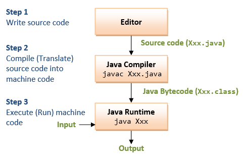

# Primeiros Passos: O Caminho que Escolhi

Para começar meus estudos, utilizarei como base dois conteúdos principais:

### Quadro Do ZERO a VAGA: Como Desenvolvedor
* Projeto desenvolvido por Dev Magro | Carrilho, que tem como objetivo "mentorar" seu editor de videos, ensinando Java e guiando-o em busca da primeira oportunidade no mercado de trabalho.

### Playlist Maratona Java
* Desenvolvida pela DevDojo, essa playlist é composta por mais de 200 aulas e busca ensinar Java desde o nível iniciante até o avançado.

# Objetivo: Registrar e Acompanhar Meus Estudos

* Este projeto tem como objetivo principal acompanhar meu aprendizado e documentar meus avanços com a linguagem de programação Java. Além disso, este repositório servirá para:

* Organizar meu progresso e anotações.

* Demonstrar meu nível de conhecimento e evolução na linguagem.

* Mostrar para possíveis recrutadores minha dedicação, organização e capacidade de aprendizado.

# Aqui, você encontrará:

* Códigos desenvolvidos durante meus estudos.

* Anotações sobre conceitos importantes.

* Reflexões sobre desafios e conquistas.

[Aula 01 - Maratona Java ](#Aula-01-Maratona-Java )
## Aula 01 - Maratona Java 

