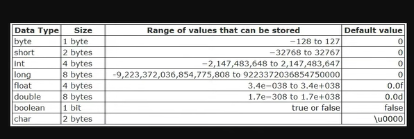

# Primeiros Passos: O Caminho que Escolhi

Para começar meus estudos, utilizarei como base dois conteúdos principais:

### Quadro Do ZERO a VAGA: Como Desenvolvedor

* Projeto desenvolvido por Dev Magro | Carrilho (https://www.youtube.com/watch?v=j-zfJ0oZLeA&t=2689s), que visa "
  mentorar" o seu editor de videos, ensinando Java e guiando-o em busca da
  primeira oportunidade no mercado de trabalho.

### Playlist Maratona Java

* Desenvolvida pela DevDojo, essa playlist é composta por mais de 200 aulas e busca
  ensinar Java desde o nível iniciante até o
  avançado(https://www.youtube.com/watch?v=VKjFuX91G5Q&list=PL62G310vn6nFIsOCC0H-C2infYgwm8SWW).

# Objetivo: Registrar e Acompanhar os meus Estudos

* Este projeto visa acompanhar o meu aprendizado e documentar os meus avanços com a linguagem de programação Java. Além
  disso, este repositório servirá para:

* Organizar o meu progresso e anotações.

* Demonstrar o meu nível de conhecimento e evolução na linguagem.

* Mostrar para possíveis recrutadores a minha dedicação, organização e capacidade de aprendizado.

# Aqui, você encontrará:

* Códigos desenvolvidos durante meus estudos.

* Anotações sobre conceitos importantes.

* Reflexões sobre desafios e conquistas.

## Sumário

- [Aula_01_Introdução_Maratona_Java](#Introdução-Maratona-Java)
- [Aula_02_Tipos_Primitivos](#Tipos-Primitivos)
- [Aula_03_Tipos_Primitivos_Exercício](#Tipos-Primitivos-Exercício)
- [Aula_04_Operadores](#Operadores)
- [Aula_05_Estruturas_Condicionais](#Estruturas-Condicionais)
- [Aula_06_Estruturas_de_Repetição](#Estruturas-de-Repetição)

## Introdução - Maratona Java

O Java é uma linguagem compilada, ou seja, o código-fonte escrito precisa ser compilado antes de ser executado.
Primeiro, o código-fonte é escrito num arquivo .java, por exemplo, MaratonaJava.java. Em seguida, utilizamos o
compilador (javac) para converter o arquivo em bytecode, gerando, por exemplo, o arquivo MaratonaJava.class. A partir
disso, utilizando uma JVM (Java Virtual Machine), é possível executar o bytecode.

## Aula 02 Tipos Primitivos

### **Comentários no Java**

- // - comentário em uma linha

- /* - comentário em mais de uma linha

## Tipos Primitivos

# Tipos Primitivos

O tipos primitivos devem ser escritos em letras minúsculas

- Int
- double
- float
- char
- byte
- short
- long
- boolean

*Tipos primitivos eles são armazenados diretamente na memória e têm um tamanho fixo,
o que os torna eficientes em termos de desempenho*

# Tipos Primitivos Exercício

Na Aula 03 fiz um exercício simples criar variáveis para nome, endereço, salário e data e
imprimir uma mensagem utilizando os tipos primitivos. A mensagem foi:

"eu 'Nome' , morando no 'endereço' , confirmo que recebi o salário de 'salário' ,
na data 'data".

# Operadores

### Aritiméticos

* Soma - o sinal de (+) indica soma
* Subtração - o sinal de (-) indica Subtração
* Divisão - o sinal de (/) significa Divisão
* Multiplicação - o sinal de (*) significa Multiplicação

Quando a operação é realizada com números inteiros o resultado são números inteiros.

### Relacionais

* Resto - % pode ser usado para saber se um número é impar ou par

### Comparação

Os operadores lógicos sempre retornarão valores booleanos

* Menor que - < verifica se o valor a esquerda é menor que o valor
  a direita. **5 < 10 == false**
* Maior que - > verifica se o valor a esquerda é maior que o valor
  a direita. **10 > 5 == True**
* Menor ou igual - <= verifica se o valor a esquerda é menor ou
  igual ao valor da direita. **15<=15 == True**
* Maior ou igual - >= verifica se o valor a esquerda é maior ou
  igual ao valor da direita.
* Igual a = == verifica se os valores são iguais
* Diferente de - != verifica se os valores diferentes

### Lógicos

* &&(AND) - Retorna True se ambas as afirmações forem verdadeiras
* ||(OR) - Retorna True se pelo menos uma condição for verdadeira
* !(NOT) - utilizado para inverter o valor de uma expressão(como se fosse um se não).

## Estruturas Condicionais

## IF

É utilizado para executar um bloco de código somente se uma condição for verdadeira

## Else If

A estrutura else if é utilizada para encadear múltiplas condições após uma verificação inicial com if. Isso permite
testar sequencialmente diferentes cenários: se a condição do if não for satisfeita, o programa passa para o else if e
assim sucessivamente.

## Operador Ternário

É uma forma concisa de escrever uma estrutura if-else

## Switch/Case

é utilizaado em casos em que temos que utilizar multiplos ifs no codigo o tornando extenso
utilizando o Switch é possivel reduzir o numero de linhas

# Estruturas de Repetição

Estruturas de repetição, também conhecidas como ‘loops’ (laços),
são utilizadas para executar repetidamente uma instrução
ou bloco de instrução enquanto determinada condição estiver concluída. As
de repetição são:

- While
- Do While
- For

## Break

O comando break pode ser utilizado em qualquer estrutura de repetição, como for, while e do-while, para interromper a
execução do loop imediatamente.

# Arrays

Em Java, arrays são objetos que armazenam múltiplos valores de um mesmo tipo. Os Arrays possuem
um valor padão que varia conforme o tipo armazenado.

# Java Core

A orientação a objetos em Java organiza o software em "objetos"
que representam entidades ou conceitos, facilitando a manutenção e a reutilização do código

# Coesão

# Métodos

### Parâmetros

### Retorno

### Parâmetros Tipos Primitivos

### Parâmetros Tipos Reference

### Parâmetros Tipos Reference This

### Varargs

## Exercicio

- Crie uma classe funcionário com os seguintes atributos: nome, idade, salário //tres salários devem ser guardados
- Crie dois métodos: para imprimir os dados e para tirar media dos salários e imprimir o resultado.  

